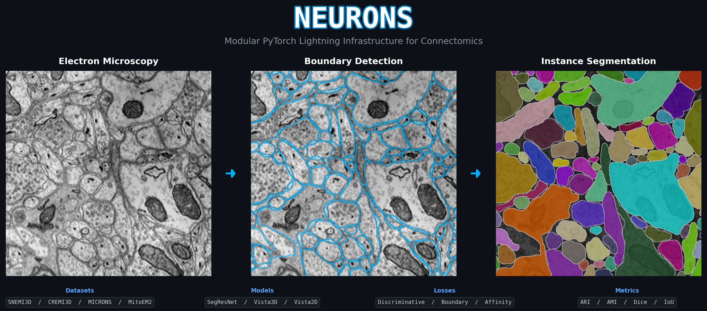

# Neurons

<p align="center">
  
</p>

A modular, extensible PyTorch Lightning-based infrastructure for connectomics research.

## Overview

**Neurons** provides a production-ready codebase for training segmentation models on electron microscopy (EM) data. It supports multiple dataset types, model architectures, and training paradigms out of the box, while remaining flexible enough for custom extensions.

## Features

- **Multi-Dataset Support** -- SNEMI3D, CREMI3D, MICRONS, MitoEM2, and combined multi-dataset training with unified label space
- **Vista Architecture** -- Vista3D and Vista2D with semantic + instance dual heads
- **Model Zoo** -- SegResNet and Vista3D wrappers via MONAI
- **Geometric Instance Losses** -- Centroid and skeleton discriminative losses with learned projection heads for direction, structure tensor, and image reconstruction
- **Evaluation Metrics** -- ARI, AMI, AXI, VOI, TED (instance); Dice, IoU (semantic)
- **Hydra Configuration** -- YAML-based config with CLI overrides, no code changes needed
- **Experiment Tracking** -- Weights & Biases and TensorBoard integration
- **EM-Specific Augmentations** -- Elastic deformation, missing sections, imaging defects
- **Multi-Format I/O** -- HDF5, TIFF, NRRD, NIfTI with automatic format detection

## Installation

```bash
git clone <repo-url> neurons
cd neurons
pip install -e ".[dev]"
```

### Dependencies

Core: PyTorch, PyTorch Lightning, MONAI, einops, Hydra, h5py, tifffile, pynrrd, scipy

## Directory Structure

```
neurons/
├── neurons/
│   ├── datasets/       # Dataset classes: SNEMI3D, CREMI3D, MICRONS, MitoEM2
│   ├── datamodules/    # Lightning DataModules + CombineDataModule
│   ├── models/         # Model wrappers: Vista3D, Vista2D, SegResNet
│   ├── modules/        # Lightning training modules: Vista3D, Vista2D
│   ├── losses/         # Discriminative (centroid + skeleton), Vista2D, Vista3D
│   ├── metrics/        # Instance (ARI, AMI, VOI, TED) and semantic (Dice, IoU)
│   ├── preprocessors/  # Format handlers: TIFF, HDF5, NRRD, NIfTI
│   ├── transforms/     # EM-specific augmentations
│   └── utils/          # I/O helpers and label utilities
├── configs/            # Hydra YAML configuration files
├── scripts/            # Training entry points and dataset download scripts
├── notebooks/          # Exploratory Jupyter notebooks
└── tests/              # Unit test suite
```

## Loss Functions

### CentroidEmbeddingLoss

Classic De Brabandere et al. (2017) discriminative loss with three optional
learned projection heads that decode geometric properties from the E-dim
embedding space:

| Head | Projection | Target |
|------|-----------|--------|
| `proj_dir` | `E -> S` | Per-pixel direction toward centroid or skeleton |
| `proj_cov` | `E -> S*S` | Per-pixel EDT structure tensor (tensor glyph) |
| `proj_raw` | `E -> 4` | RGBA image reconstruction |

The `dir_target` parameter selects between `"centroid"` (offset toward
instance centroid) and `"skeleton"` (offset toward nearest topology-preserving
skeleton point).

### SkeletonEmbeddingLoss

Geometry-aware variant operating on predicted offset fields. Four
differentiable terms: L2 pull to nearest skeleton point, pairwise push on
instance centres, cosine boundary penalty (DT gradient alignment), and
skeleton benefit (differentiable DT sampling via `grid_sample`).

### Vista2DLoss / Vista3DLoss

Combined semantic (CE + optional Dice) and instance (pull/push/norm)
losses for the two-head Vista architecture, with boundary and skeleton
weighting via morphological gradient and normalised EDT.

## Quick Start

### 1. Explore your data

```bash
jupyter notebook notebooks/01_explore_snemi3d.ipynb
```

### 2. Train a segmentation model

```bash
python scripts/train.py --config-name snemi3d
```

### 3. Override parameters via CLI

```bash
python scripts/train.py --config-name snemi3d \
    data.batch_size=8 \
    training.max_epochs=200 \
    optimizer.lr=5e-4
```

### 4. Train with combined datasets

```bash
python scripts/train.py --config-name combine
```

### 5. Fast development run

```bash
python scripts/train.py training.fast_dev_run=true
```

## Configuration

All behavior is driven by YAML configs in `configs/`:

| Config | Description |
|--------|-------------|
| `default.yaml` | Base configuration with all defaults |
| `snemi3d.yaml` | SNEMI3D neuron segmentation |
| `cremi3d.yaml` | CREMI3D multi-class segmentation |
| `microns.yaml` | MICRONS large-scale connectomics |
| `combine.yaml` | Multi-dataset Vista3D training |

## Training

Vista3D (default) and Vista2D modules jointly train semantic and instance heads.

```yaml
model:
  type: vista3d          # or vista2d
  num_classes: 16
  emb_dim: 16
loss:
  ce_weight: 0.5
  dice_weight: 0.5
  weight_pull: 1.0
  weight_push: 1.0
  delta_v: 0.5
  delta_d: 1.5
```

## Running Tests

```bash
pytest tests/ -v
```

## License

See LICENSE file.
