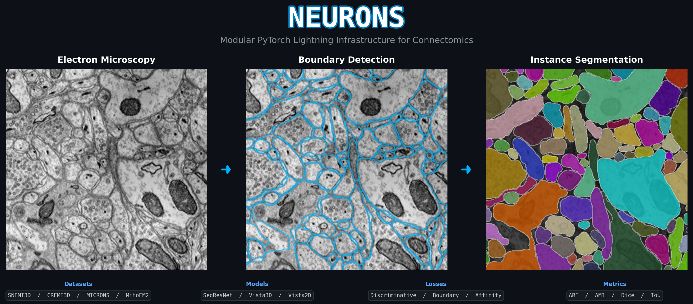

# Neurons

<p align="center">
  
</p>

A modular, extensible PyTorch Lightning-based infrastructure for connectomics research.

## Overview

**Neurons** provides a production-ready codebase for training segmentation models on electron microscopy (EM) data. It supports multiple dataset types, model architectures, and training paradigms out of the box, while remaining flexible enough for custom extensions.

## Features

- **Multi-Dataset Support** -- SNEMI3D, CREMI3D, MICRONS, MitoEM2, and combined multi-dataset training with unified label space
- **Vista Architecture** -- Vista3D and Vista2D with semantic + instance dual heads
- **Model Zoo** -- Vista3D backbone via MONAI (SegResNet fallback)
- **Geometric Instance Losses** -- Centroid and skeleton discriminative losses with learned projection heads for direction, structure tensor, and image reconstruction
- **Evaluation Metrics** -- ARI, AMI, AXI, VOI, TED (instance); Dice, IoU (semantic)
- **Hydra Configuration** -- YAML-based config with CLI overrides, no code changes needed
- **Experiment Tracking** -- Weights & Biases and TensorBoard integration
- **EM-Specific Augmentations** -- Elastic deformation, missing sections, imaging defects
- **Multi-Format I/O** -- HDF5, TIFF, NRRD, NIfTI with automatic format detection

## Installation

```bash
git clone <repo-url> neurons
cd neurons
pip install -e ".[dev]"
```

### Dependencies

Core: PyTorch, PyTorch Lightning, MONAI, einops, Hydra, h5py, tifffile, pynrrd, scipy

## Directory Structure

```
neurons/
├── neurons/
│   ├── datasets/       # Dataset classes: SNEMI3D, CREMI3D, MICRONS, MitoEM2
│   ├── datamodules/    # Lightning DataModules + CombineDataModule
│   ├── models/         # Model wrappers: Vista3D, Vista2D (SegResNet fallback)
│   ├── modules/        # Lightning training modules: Vista3D, Vista2D
│   ├── losses/         # Discriminative (centroid + skeleton), Vista2D, Vista3D
│   ├── metrics/        # Instance (ARI, AMI, VOI, TED) and semantic (Dice, IoU)
│   ├── preprocessors/  # Format handlers: TIFF, HDF5, NRRD, NIfTI
│   ├── transforms/     # EM-specific augmentations
│   └── utils/          # I/O helpers and label utilities
├── configs/            # Hydra YAML configuration files
├── scripts/            # Training entry points and dataset download scripts
├── notebooks/          # Exploratory Jupyter notebooks
└── tests/              # Unit test suite
```

## Loss Functions

### Vista3DLoss / Vista2DLoss

The main training losses compose three branches:

| Branch | Head | Loss components |
|--------|------|-----------------|
| **Semantic** | `head_semantic` | CE + soft IoU + soft Dice |
| **Instance** | `head_instance` | Pull/push/norm discriminative (boundary + skeleton weighted) |
| **Geometry** | `head_geometry` | L_dir + L_cov + L_raw (auxiliary, not used at inference) |

The geometry head is purely an auxiliary training signal that enriches
backbone gradients.  Set `weight_cov: 0.0` to disable the expensive
structure tensor computation (recommended for large-scale training).
L_dir (centroid offsets) and L_raw (image reconstruction) are cheap
and provide useful regularisation.

### CentroidEmbeddingLoss

Classic De Brabandere et al. (2017) discriminative loss.
Pull same-instance embeddings together, push different-instance centroids
apart, regularise norms.

### SkeletonEmbeddingLoss

Geometry-aware variant operating on predicted offset fields. Four
differentiable terms: L2 pull to nearest skeleton point, pairwise push on
instance centres, cosine boundary penalty (DT gradient alignment), and
skeleton benefit (differentiable DT sampling via `grid_sample`).

## Quick Start

### 1. Explore your data

```bash
jupyter notebook notebooks/01_explore_snemi3d.ipynb
```

### 2. Train a segmentation model

```bash
python scripts/train.py --config-name snemi3d
```

### 3. Override parameters via CLI

```bash
python scripts/train.py --config-name snemi3d \
    data.batch_size=8 \
    training.max_epochs=200 \
    optimizer.lr=5e-4
```

### 4. Train with combined datasets

```bash
python scripts/train.py --config-name combine
```

### 5. Fast development run

```bash
python scripts/train.py training.fast_dev_run=true
```

### 6. Visualize volumes

```bash
# SNEMI3D (AC4 training volume, resolution 6x6x30 nm)
python -m neurons.visualizer \
    --raw data/snemi3d/AC4_inputs.h5 \
    --seg data/snemi3d/AC4_labels.h5 \
    --spacing 30,6,6

# CREMI3D (sample A)
python -m neurons.visualizer \
    --raw data/cremi3d/sample_A.h5:volumes/raw \
    --seg data/cremi3d/sample_A.h5:volumes/labels/neuron_ids \
    --spacing 40,4,4

# MICrONS
python -m neurons.visualizer \
    --raw data/microns/volume.h5 \
    --seg data/microns/segmentation.h5 \
    --spacing 40,4,4
```

Opens a web viewer at `http://localhost:8899` with 4-panel layout (axial, coronal, sagittal, 3D Gaussian splats). Add `--no-browser` to skip auto-opening.

### 7. Profile training

```bash
python scripts/train.py --config-name profiler
```

## Configuration

All behavior is driven by YAML configs in `configs/`:

| Config | Description |
|--------|-------------|
| `default.yaml` | Base configuration with all defaults |
| `snemi2d.yaml` | SNEMI3D 2D slice segmentation (Vista2D) |
| `snemi3d.yaml` | SNEMI3D 3D volumetric segmentation (Vista3D) |
| `cremi3d.yaml` | CREMI3D multi-class segmentation |
| `microns.yaml` | MICRONS large-scale connectomics |
| `combine.yaml` | Multi-dataset Vista3D training |
| `snemi3d_microns.yaml` | Combined SNEMI3D + MICRONS training |
| `foundation.yaml` | Foundation model (all datasets) |
| `profiler.yaml` | Profiling configuration |

## Training

Vista3D (default) and Vista2D modules jointly train semantic and instance heads.

```yaml
model:
  type: vista3d          # or vista2d
  num_classes: 16
  emb_dim: 16
loss:
  weight_ce: 1.0
  weight_dice: 1.0
  weight_iou: 1.0
  weight_pull: 1.0
  weight_push: 1.0
  delta_v: 0.5
  delta_d: 1.5
  weight_geometry: 1.0   # auxiliary geometry head (0.0 to disable)
  weight_cov: 0.0        # disable expensive structure tensor (recommended)
```

## GPU Acceleration

When [cupy](https://cupy.dev/) is installed, several expensive operations
are automatically accelerated on GPU:

| Operation | CPU fallback | GPU (cupy) |
|-----------|-------------|------------|
| Distance transform (EDT) | `scipy.ndimage.distance_transform_edt` | `cupyx.scipy.ndimage.distance_transform_edt` |
| Gaussian filter | `scipy.ndimage.gaussian_filter` | `cupyx.scipy.ndimage.gaussian_filter` |
| Connected components | `scipy.ndimage.label` | `cupyx.scipy.ndimage.label` |

Data transfer between PyTorch and cupy uses **DLPack zero-copy** — no
host/device round-trips.  See `neurons/utils/gpu_ndimage.py` for the
`torch_to_cupy()` / `cupy_to_torch()` helpers.

DataLoader workers (forked processes) automatically fall back to the CPU
path since CUDA contexts do not survive `fork()`.

## Running Tests

```bash
pytest tests/ -v
```

## License

See LICENSE file.
